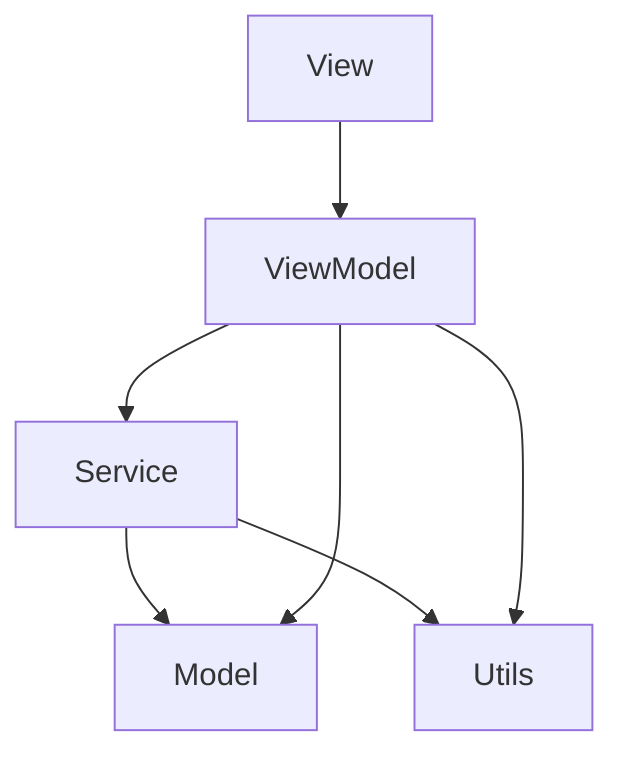

# PostureTracker 架构设计

## 概述

PostureTracker 采用 **MVVM (Model-View-ViewModel)** 架构模式，结合 **Combine** 框架实现响应式编程，使用 **SwiftUI** 构建用户界面。

## 架构原则

### 1. 单一职责原则 (SRP)
- 每个类/模块只负责一个功能
- 清晰的层次划分和职责边界

### 2. 依赖倒置原则 (DIP)
- 高层模块不依赖低层模块
- 通过协议定义接口契约

### 3. 开闭原则 (OCP)
- 对扩展开放，对修改关闭
- 通过协议和扩展实现功能增强

## 架构层次

```
┌──────────────────────────────────────────┐
│                  Views                    │  ← SwiftUI 视图层
├──────────────────────────────────────────┤
│               ViewModels                  │  ← 视图模型层 (业务逻辑)
├──────────────────────────────────────────┤
│                Services                   │  ← 服务层 (核心功能)
├──────────────────────────────────────────┤
│                 Models                    │  ← 数据模型层
├──────────────────────────────────────────┤
│            Utils & Extensions             │  ← 工具层
└──────────────────────────────────────────┘
```

## 数据流

### 单向数据流
```
User Action → View → ViewModel → Service → Model
                ↑                              ↓
                └──────── Update ←─────────────┘
```

### Combine 数据流
```swift
// 传感器数据流
AirPodsMotionManager
    .motionDataPublisher          // 原始数据
    .map(DataProcessor.process)   // 数据处理
    .sink(MotionViewModel.update) // 更新视图模型
    
// 状态变化流
ViewModel.$state
    .receive(on: RunLoop.main)    // 主线程接收
    .assign(to: View.state)        // 更新视图
```

## 模块详解

### 1. Models (数据模型层)

**职责**：定义数据结构和业务实体

```
Models/
├── Posture.swift          # 姿态数据模型
├── MotionData.swift       # 运动数据模型
├── Session.swift          # 会话数据模型
├── User.swift             # 用户配置模型
└── CalibrationData.swift  # 校准数据模型
```

**设计要点**：
- 所有模型实现 `Codable` 协议
- 不包含业务逻辑，只定义数据结构
- 提供便利的初始化方法和计算属性

### 2. Services (服务层)

**职责**：提供核心功能服务

```
Services/
├── AirPodsMotionManager.swift  # 传感器管理
├── AudioFeedbackManager.swift  # 音频反馈
├── DataLogger.swift            # 数据存储
├── CloudService.swift          # 云端同步
├── SyncManager.swift           # 同步管理
└── CacheManager.swift          # 缓存管理
```

**设计模式**：
- 单例模式：全局唯一实例
- 发布-订阅：使用 Combine Publisher
- 策略模式：可配置的行为策略

### 3. ViewModels (视图模型层)

**职责**：处理业务逻辑，连接视图和模型

```
ViewModels/
├── MotionViewModel.swift       # 运动数据视图模型
├── SessionViewModel.swift      # 会话管理视图模型
├── SettingsViewModel.swift     # 设置视图模型
├── StatisticsViewModel.swift   # 统计视图模型
└── CalibrationViewModel.swift  # 校准视图模型
```

**核心功能**：
- 使用 `@Published` 发布状态变化
- 订阅服务层的数据流
- 处理用户交互逻辑
- 数据转换和格式化

### 4. Views (视图层)

**职责**：用户界面展示

```
Views/
├── ContentView.swift              # 主视图容器
├── PostureVisualizationView.swift # 姿态可视化
├── ControlPanelView.swift         # 控制面板
├── StatisticsView.swift           # 统计图表
├── SettingsView.swift             # 设置界面
├── CalibrationView.swift          # 校准向导
└── Components/                    # 可重用组件
    ├── GaugeView.swift
    ├── ChartView.swift
    └── ButtonStyles.swift
```

**设计原则**：
- 声明式 UI (SwiftUI)
- 组件化和可重用
- 响应式更新
- 关注点分离

### 5. Utils (工具层)

**职责**：提供通用工具和算法

```
Utils/
├── DataProcessor.swift         # 数据处理算法
├── PostureAnalyzer.swift      # 姿态分析算法
├── StatisticsCalculator.swift # 统计计算
├── CalibrationHelper.swift    # 校准算法
└── Extensions/                # Swift 扩展
    ├── Double+Angle.swift
    ├── Date+Format.swift
    └── Color+Theme.swift
```

## 关键设计模式

### 1. MVVM 模式
```swift
// View
struct PostureView: View {
    @StateObject private var viewModel = PostureViewModel()
    
    var body: some View {
        // UI 绑定到 viewModel 的状态
    }
}

// ViewModel
class PostureViewModel: ObservableObject {
    @Published var posture: Posture = .zero
    private var cancellables = Set<AnyCancellable>()
    
    init() {
        // 订阅数据源
        AirPodsMotionManager.shared.postureChangePublisher
            .assign(to: \.posture, on: self)
            .store(in: &cancellables)
    }
}
```

### 2. 单例模式
```swift
class AirPodsMotionManager {
    static let shared = AirPodsMotionManager()
    private init() { }
}
```

### 3. 策略模式
```swift
protocol FeedbackStrategy {
    func shouldProvideFeedback(deviation: Double) -> Bool
}

class AdaptiveFeedbackStrategy: FeedbackStrategy {
    func shouldProvideFeedback(deviation: Double) -> Bool {
        // 自适应逻辑
    }
}
```

### 4. 观察者模式 (Combine)
```swift
// Publisher
let posturePublisher = PassthroughSubject<Posture, Never>()

// Subscriber
posturePublisher
    .filter { $0.isValid }
    .sink { posture in
        // 处理姿态数据
    }
    .store(in: &cancellables)
```

## 依赖关系



## 线程管理

### 主线程 (Main Thread)
- UI 更新
- 用户交互
- SwiftUI 视图渲染

### 后台线程 (Background Thread)
- 数据处理
- 网络请求
- 文件 I/O
- 复杂计算

```swift
// 线程切换示例
dataPublisher
    .receive(on: DispatchQueue.global())  // 后台处理
    .map(processData)
    .receive(on: DispatchQueue.main)      // 主线程更新
    .assign(to: \.data, on: self)
```

## 错误处理

### 错误类型
```swift
enum AppError: LocalizedError {
    case sensorNotAvailable
    case networkError(String)
    case dataCorrupted
    
    var errorDescription: String? {
        // 错误描述
    }
}
```

### 错误传播
```swift
// Combine 错误处理
publisher
    .tryMap { try processData($0) }
    .catch { error in
        Just(defaultValue)
    }
    .sink { /* 处理结果 */ }
```

## 性能优化

### 1. 内存管理
- 使用 `weak self` 避免循环引用
- 及时释放大对象
- 使用 `@StateObject` 和 `@ObservedObject` 正确管理生命周期

### 2. 数据缓冲
- 实现循环缓冲区
- 限制内存中的数据量
- 定期清理过期数据

### 3. 异步处理
- 使用 Combine 进行异步操作
- 避免阻塞主线程
- 批量处理数据

## 测试策略

### 单元测试
- 测试数据模型
- 测试业务逻辑
- 测试算法正确性

### 集成测试
- 测试服务交互
- 测试数据流
- 测试错误处理

### UI 测试
- 测试用户流程
- 测试界面响应
- 测试状态转换

## 扩展性设计

### 协议定义
```swift
protocol MotionDataSource {
    func startTracking()
    func stopTracking()
    var motionDataPublisher: AnyPublisher<MotionData, Never> { get }
}
```

### 依赖注入
```swift
class MotionViewModel {
    private let dataSource: MotionDataSource
    
    init(dataSource: MotionDataSource = AirPodsMotionManager.shared) {
        self.dataSource = dataSource
    }
}
```

## 安全考虑

### 数据安全
- 本地数据加密存储
- 使用 Keychain 存储敏感信息
- HTTPS 传输

### 隐私保护
- 最小权限原则
- 用户数据匿名化
- 提供数据删除选项

## 部署架构

### 本地环境
- Xcode 15+
- iOS 14+
- Swift 5.9+

### 云端服务
- Firebase Firestore (数据存储)
- Firebase Storage (文件存储)
- Firebase Auth (用户认证)

### CI/CD
- GitHub Actions
- Fastlane
- TestFlight

## 监控和日志

### 日志级别
```swift
Logger.debug("调试信息")
Logger.info("一般信息")
Logger.warning("警告信息")
Logger.error("错误信息")
```

### 性能监控
- 内存使用
- CPU 占用
- 电池消耗
- 网络流量

## 版本管理

### 语义化版本
- MAJOR.MINOR.PATCH
- 例：1.2.3

### 分支策略
- main: 生产版本
- develop: 开发版本
- feature/*: 功能分支
- bugfix/*: 修复分支
- release/*: 发布分支